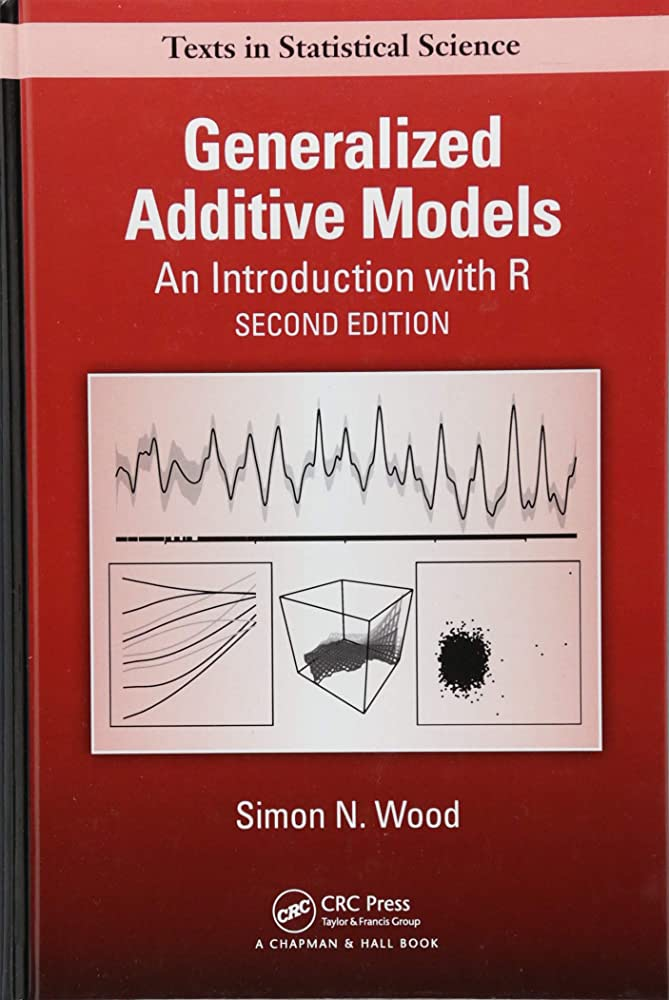

class: middle center
```{r setup, include=FALSE, cache=FALSE}
options(htmltools.dir.version = FALSE)
knitr::opts_chunk$set(cache = FALSE, dev = 'svg', echo = TRUE,
                      message = FALSE, warning = FALSE,
                      fig.align = 'center',
                      fig.height = 5.1, fig.width = 1.9 * 5.1)
library('mgcv')
library('mvgam')
library('forecast')
library('gamair')
library('ggplot2')
library('viridis')
library('fontawesome')
library('gratia')
library('ggborderline')
library('kableExtra')
theme_set(theme_bw(base_size = 12, base_family = 'serif'))
options(ggplot2.discrete.colour = c("#B97C7C",
                              "#A25050",
                              "#8F2727",
                              "#630000"),
        ggplot2.discrete.fill = c("#B97C7C",
                            "#A25050",
                            "#8F2727",
                            "#630000"))
```

```{r xaringan-panelset, echo=FALSE}
xaringanExtra::use_panelset()
xaringanExtra::style_panelset_tabs(foreground = '#8F2727',
                                   inactive_opacity = 0.8)
```

```{r xaringan-animate-css, echo=FALSE}
xaringanExtra::use_animate_css()
```

```{r xaringanExtra-clipboard, echo=FALSE}
xaringanExtra::use_clipboard()
```

```{r xaringan-tile, echo=FALSE}
xaringanExtra::use_tile_view()
```

```{r setup II, echo = FALSE}
c_light <- c("#DCBCBC")
c_light_highlight <- c("#C79999")
c_mid <- c("#B97C7C")
c_mid_highlight <- c("#A25050")
c_dark <- c("#8F2727")
c_dark_highlight <- c("#7C0000")

multipar = function(...){
  par(family = "serif", 
    bty = "l", 
    cex.axis = 1.1, 
    cex.lab = 1.1, 
    cex.main = 1.3,
    xaxs = 'r',
    yaxs = 'r',
    pch = 16)
}

mypar = function(...){
  par(family = "serif", 
      las = 1, 
      mar=c(4,4.1,2,2),
      mgp = c(2,0.5,0),
      bty = "l", 
      cex.axis = 1.25, 
      cex.lab = 1.5, 
      cex.main = 1.5,
      xaxs = 'r',
      yaxs = 'r',
      pch = 16)
}

myparsmall = function(...){
  par(family = "serif", 
      las = 1, 
      mgp = c(4, 1, 0),
      mar=c(5,6,2,2),
      bty = "l", 
      cex.axis = 1.85, 
      cex.lab = 2.75, 
      cex.main = 2.75,
      xaxs = 'r',
      yaxs = 'r',
      pch = 16)
}

myhist = function(x, 
                  xlim,
                  xlab = '',
                  main = '',
                  big = TRUE){

  if(big){
      mypar()
  } else {
      myparsmall()
  }

  if(missing(xlim)){
    xlim <- range(x, na.rm = TRUE)
  }
  
  hist(x, 
       xlim = xlim,
       yaxt = 'n',
       xlab = xlab,
       ylab = '',
       col = c_mid_highlight,
       border = 'white',
       lwd = 2,
       breaks = 20,
       main = main)
}

mybar = function(x, 
                  xlab = '',
                  main = '',
                  big = TRUE){

  if(big){
      mypar()
  } else {
      myparsmall()
  }
  
  barplot(table(x),
          yaxt = 'n',
          xlab = xlab,
          border = NA,
       ylab = '',
       col = c_mid_highlight,
       lwd = 2,
       main = main)
  axis(1, labels = NA, tck=0, lwd =2)
}

mylines = function(x, xlab = '', 
                   ylim,
                   ylab = '',
                   big = TRUE){

  if(big){
      mypar()
  } else {
      myparsmall()
  }
  
  if(missing(ylim)){
      plot(x = x, 
       type = 'l',
       col = c_dark_highlight,
       lwd = 3.5,
       bty = 'l',
       xlab = xlab,
       ylab = ylab)
  } else {
      plot(x = x, 
       ylim = ylim,
       type = 'l',
       col = c_dark_highlight,
       lwd = 3.5,
       bty = 'l',
       xlab = xlab,
       ylab = ylab)
  }

  box(bty = 'l', lwd = 2)
}

myscatter = function(x, 
                     y, 
                     xlab = '', 
                     ylab = '', 
                     big = TRUE){
  
    if(big){
      mypar()
  } else {
      myparsmall()
  }

  plot(x = x, 
       y = y, 
       pch = 21,
       bg = c_dark,
       col = 'white',
       cex = 2,
       bty = 'l',
       xlab = xlab,
       ylab = ylab)
  box(bty = 'l', lwd = 2)
}
```

class: animated fadeIn
<body><div id="pan"></div></body>

---
class: animated fadeIn
background-image: url('./resources/smooth_only.gif')
## GAMs use splines ...

```{r basis-functions, fig.height=4.6875, fig.width = 7.5, echo=FALSE,message=FALSE,warning=FALSE,fig.show='hide'}
set.seed(7)
N <- 400
y <- mvgam::sim_mvgam(T = N, prop_missing = 0,
                      prop_train = 1,
                      family = gaussian(),
                      n_series = 1,
                      trend_model = 'GP',
                      trend_rel = 0.95)$data_train$y
x <- 1:N
data <- data.frame(x = x,
                   y = y)
theme_set(theme_classic(base_size = 17, base_family = 'serif'))
basis_funs <- basis(s(x, bs = 'cr', k = 12), 
                    data = data)
ggplot(basis_funs,
       aes(x = x, y = value, colour = bf)) +
  geom_borderline(linewidth=1.5, bordercolour = "white") +
  scale_color_viridis(discrete = TRUE) +
  theme(legend.position = 'none',
        axis.line = element_line(size = 1),
        axis.ticks = element_line(colour = "black", size = 1)) +
  ylab('f(Time)') + xlab('Time') + 
  scale_y_continuous(breaks = c(0, 1))
```

---

background-image: url('./ASC_talk_slidedeck_files/figure-html/basis-functions-1.svg')
## ... made of basis functions

```{r basis-functions-weights, fig.height=4.6875, fig.width = 7.5, echo=FALSE,message=FALSE,warning=FALSE,fig.show='hide'}
set.seed(7)
N <- 400
y <- mvgam::sim_mvgam(T = N, prop_missing = 0,
                      prop_train = 1,
                      family = gaussian(),
                      n_series = 1,
                      trend_model = 'GP',
                      trend_rel = 0.95)$data_train$y
x <- 1:N
data <- data.frame(x = x,
                   y = rnorm(n = N, mean = y, sd = 0.75))
theme_set(theme_classic(base_size = 17, base_family = 'serif'))
basis_funs <- basis(gam(y ~ s(x, bs = 'cr', k = 12) - 1, 
                    data = data))
ggplot(basis_funs,
       aes(x = x, y = value, colour = bf)) +
  geom_borderline(linewidth=1.5, bordercolour = "white") +
  scale_color_viridis(discrete = TRUE) +
  theme(legend.position = 'none',
        axis.line = element_line(size = 1),
        axis.ticks = element_line(colour = "black", size = 1)) +
  ylab('f(Time)') + xlab('Time') + 
  scale_y_continuous(breaks = c(0, 1))
```
---


background-image: url('./resources/basis-functions-weights-1.svg')
## Weighting basis functions ...

---

background-image: url('./resources/basis_weights.gif')
## ... gives a spline $(f(x))$

---

background-image: url('./resources/smooth_to_data.gif')
## Penalize $f"(x)$ to learn weights

---

class: full-size

## Easy to fit in `r fontawesome::fa("r-project", fill = "steelblue")`

$$\mathbb{E}(\boldsymbol{Y_t}|\boldsymbol{X_t})=g^{-1}(\alpha + \sum_{j=1}^{J}f(x_{jt}))$$

<br/>
Where: 
- $g^{-1}$ is the inverse of the link function
- ${\alpha}$ is the intercept
- $f(x)$ are potentially nonlinear functions of the $J$ predictors

```{r complexity, echo=FALSE, fig.height = 7, fig.width = 10,fig.show='hide'}
df <- data_sim("eg1", n = 200, seed = 1)
df$x4 <- rnorm(NROW(df))
df$x3 <- df$y * mvgam::sim_mvgam(T = 200, n_series = 1,
                                 prop_train = 1,
                                 trend_model = 'GP',
                                 trend_rel = 0.5,
                                 family = gaussian())$data_train$y
m_sim <- gam(y ~ s(x0, bs = 'gp') + te(x1, x2) + s(x3) +
               s(x4, bs = 'cs'),
             data = df, method = "REML")
theme_set(theme_classic(base_size = 18, base_family = 'serif'))
draw(m_sim, ci_col = "#A25050",
     smooth_col = "#7C0000",
     residuals = TRUE,
     resid_col = 'black',
     ci_alpha = 0.5)

```

---

background-image: url('./ASC_talk_slidedeck_files/figure-html/complexity-1.svg')

---

## What's the catch?

```{r echo = FALSE}
library(mvgam)
load('resources/gausdat.rds')
# Update these models so they work with newer mvgam versions
splinemod$model_data <- list()
attr(splinemod$model_data, 'trend_model') = 'None'
gpmod$model_data <- list()
attr(gpmod$model_data, 'trend_model') = 'GP'
multipar()
plot_mvgam_series(data = gausdat$data_train, newdata = gausdat$data_test)
```

---

## A spline of `time`
```{r eval = FALSE}
library(mgcv)
model <- gam(y ~ s(time, k = 20, bs = 'bs', m = 2), #<<
                data = data,
                family = gaussian())
```

A B-spline (`bs = 'bs'`) with `m = 2` sets the penalty on the second derivative

---

## Hindcasts `r fontawesome::fa("face-smile-beam")`

```{r echo = FALSE, message=FALSE}
mypar()
plot(hindcast(splinemod), xlab = 'time', ylab = 'Predictions')
```

---

## Extrapolate 2-steps ahead `r fontawesome::fa("face-smile")`

```{r echo = FALSE}
mypar()
plot_mvgam_smooth(splinemod, 
                  smooth = 's(time)',
                  newdata = data.frame(time = 1:(max(gausdat$data_train$time)+2)))
abline(v = max(gausdat$data_train$time), lwd = 2, lty = 'dashed')
```

---

## 5-steps ahead `r fontawesome::fa("face-frown")`

```{r echo = FALSE}
mypar()
plot_mvgam_smooth(splinemod, 
                  smooth = 's(time)',
                  newdata = data.frame(time = 1:(max(gausdat$data_train$time)+5)))
abline(v = max(gausdat$data_train$time), lwd = 2, lty = 'dashed')
```

---

## 20-steps ahead `r fontawesome::fa("face-sad-tear")`

```{r echo = FALSE}
mypar()
plot_mvgam_smooth(splinemod, 
                  smooth = 's(time)',
                  newdata = data.frame(time = 1:(max(gausdat$data_train$time)+20)))
abline(v = max(gausdat$data_train$time), lwd = 2, lty = 'dashed')
```

---

background-image: url('./resources/basis_weights.gif')
## Basis functions &#8680; local knowledge

---
## Basis functions &#8680; local knowledge

```{r echo = FALSE}
mypar()
set.seed(100)
plot_mvgam_smooth(splinemod, 
                  smooth = 's(time)',
                  newdata = data.frame(time = 1:(max(gausdat$data_train$time)+20)),
                  realisations = TRUE,
                  n_realisations = 2)
abline(v = max(gausdat$data_train$time), lwd = 2, lty = 'dashed')
```

---

## Basis functions &#8680; local knowledge

```{r echo = FALSE}
mypar()
set.seed(100)
plot_mvgam_smooth(splinemod, 
                  smooth = 's(time)',
                  newdata = data.frame(time = 1:(max(gausdat$data_train$time)+20)),
                  realisations = TRUE,
                  n_realisations = 8)
abline(v = max(gausdat$data_train$time), lwd = 2, lty = 'dashed')
```

---

## Basis functions &#8680; local knowledge

```{r echo = FALSE}
mypar()
set.seed(100)
plot_mvgam_smooth(splinemod, 
                  smooth = 's(time)',
                  newdata = data.frame(time = 1:(max(gausdat$data_train$time)+20)),
                  realisations = TRUE,
                  n_realisations = 20)
abline(v = max(gausdat$data_train$time), lwd = 2, lty = 'dashed')
```

---
## Forecasts `r fontawesome::fa("face-sad-cry")`

```{r echo = FALSE, message = FALSE, results='hide'}
mypar()
plot(splinemod, type = 'forecast', newdata = gausdat$data_test, xlab = 'time',
     ylab = 'Predictions')
```

---
## We need *global* knowledge
```{r echo = FALSE}
mypar()
set.seed(100)
plot(gpmod, type = 'trend', 
     newdata = gausdat$data_test, 
     xlab = 'time',
     ylab = 'Partial effect',
     realisations = TRUE,
     n_realisations = 1)
rug(1:max(gausdat$data_train$time),
    lwd = 1.75, ticksize = 0.025, col = "#A25050")
```

---

## We need *global* knowledge
```{r echo = FALSE}
mypar()
set.seed(100)
plot(gpmod, type = 'trend', 
     newdata = gausdat$data_test, 
     xlab = 'time',
     ylab = 'Partial effect',
     realisations = TRUE,
     n_realisations = 5)
rug(1:max(gausdat$data_train$time),
    lwd = 1.75, ticksize = 0.025, col = "#A25050")
```

---

## We need *global* knowledge
```{r echo = FALSE}
mypar()
set.seed(100)
plot(gpmod, type = 'trend', 
     newdata = gausdat$data_test, 
     xlab = 'time',
     ylab = 'Partial effect',
     realisations = TRUE,
     n_realisations = 20)
rug(1:max(gausdat$data_train$time),
    lwd = 1.75, ticksize = 0.025, col = "#A25050")
```

---
## We need *global* knowledge
```{r echo = FALSE, message = FALSE, results='hide'}
mypar()
plot(gpmod, type = 'forecast', newdata = gausdat$data_test, xlab = 'time',
     ylab = 'Predictions')
```

---

## Dynamic GAMs

$$\mathbb{E}(\boldsymbol{Y_t}|\boldsymbol{X_t})=g^{-1}(\alpha + \sum_{j=1}^{J}f(x_{jt}) + z_t)$$

<br/>
Where: 
- $g^{-1}$ is the inverse of the link function
- ${\alpha}$ is the intercept
- $f(x)$ are potentially nonlinear functions of the $J$ predictors
- $z_t$ is a .emphasize[*latent dynamic process*]

---

## Modelling with the [`mvgam` 📦](https://github.com/nicholasjclark/mvgam/tree/master)

Bayesian framework to fit Dynamic GLMs and Dynamic GAMs
- Hierarchical intercepts, slopes and smooths
- Latent dynamic processes
- State-Space models with measurement error

Built off the [`mgcv` 📦](https://cran.r-project.org/web/packages/mgcv/index.html) to construct penalized smoothing splines

Convenient and familiar `r fontawesome::fa("r-project", fill = "steelblue")` formula interface

Uni- or multivariate series from a range of response distributions 

Uses [Stan](https://mc-stan.org/) for efficient Hamiltonian Monte Carlo sampling

---

## Observation families


`gaussian()`, `student-t()` &#8680; real values in $(-\infty, \infty)$   
 
`lognormal()`, `Gamma()` &#8680; positive real values in $[0, \infty)$   

`betar()`  &#8680; real values (proportional) in $[0,1]$  

`poisson()`, `nb()` &#8680; non-negative integers in $(0,1,2,...)$  

---

## Extended predictor effects


`s()` &#8680; Smoothing spline of one or more covariates

`s(bs = 're')` &#8680; Hierarchical slopes or intercepts

`te(), ti(), t2()` &#8680; Tensor product smoothing spline of two or more covariates   

`gp()` &#8680; Gaussian Process function (with squared exponential kernel) of one covariate  

`dynamic()` &#8680; Time-varying effect of one covariate                             

---

class: middle center
### We can fit models that include random effects, nonlinear effects and complex multidimensional smooth functions. All these effects can operate .emphasize[*on both process and observation models*]
<br>
### Can incorporate unobserved temporal dynamics; no need to regress the outcome on past values or resort to transformations
<br>
### What kinds of dynamic processes are available in the `mvgam` 📦?


---

## Piecewise linear...
```{r echo=FALSE}
# set seed for reproducibility
set.seed(4321)

# simulate a piecewise linear trend
n_changes <- 7
change_times <- c(10, 18, 25, 45, 60, 63, 89)
lambda <- 0.22
deltas_new <- extraDistr::rlaplace(n_changes,
                                   mu = 0,
                                   sigma = lambda)
trend <- mvgam:::piecewise_linear(
  t = 1:100, 
  deltas = deltas_new, 
  k = 0.02,
  m = 1, 
  changepoint_ts = change_times)
series <- rnorm(100, mean = scale(trend),
                sd = 0.001)

# plot the time series as a line
mypar()
plot(series, type = 'l', bty = 'l', lwd = 2, 
     col = 'darkred', ylab = 'z', xlab = 'Time')
```


---

## ...or logistic with upper saturation
```{r echo=FALSE}
# set seed for reproducibility
set.seed(4321)

# simulate a piecewise logistic trend
n_changes <- 7
change_times <- c(10, 18, 25, 45, 60, 63, 89)
lambda <- 0.22
deltas_new <- extraDistr::rlaplace(n_changes,
                                   mu = 0,
                                   sigma = lambda)
trend <- mvgam:::piecewise_logistic(
  t = 1:100, 
  cap = 9, 
  deltas = deltas_new, 
  k = 0.02,
  m = 1, 
  changepoint_ts = change_times)
series <- rnorm(100, mean = trend - mean(trend),
                sd = 0.001)

# plot the time series as a line
mypar()
plot(series, type = 'l', bty = 'l', lwd = 2, 
     col = 'darkred', ylab = 'z', xlab = 'Time')
```

---

## RW or ARMA(p = 1-3, q = 0-1)
```{r echo=FALSE}
# set seed for reproducibility
set.seed(1111)

# number of timepoints
T <- 100

# use arima.sim to simulate from a AR1 model (phi = 0.7)
series <- arima.sim(model = list(ar = 0.7), n = T, sd = 1)

# plot the time series as a line
mypar()
plot(series, type = 'l', bty = 'l', lwd = 2, 
     col = 'darkred', ylab = 'z', xlab = 'Time')
```


---

## Gaussian Process...
```{r echo=FALSE}
# set a seed for reproducibility
set.seed(2222)

# simulate from a fairly large length-scale parameter
rho <- 16

# set the alpha parameter to 1 for all simulations
alpha <- 1

# simulate functions that span 50 time points
times <- 1:50

# generate a sequence of prediction values
draw_seq <- seq(min(times), max(times), length.out = 100)

# construct the temporal covariance matrix
Sigma <- alpha^2 * 
  exp(-0.5 * ((outer(draw_seq, draw_seq, "-") / rho) ^ 2)) +
  diag(1e-12, length(draw_seq))

# draw a single realization from the GP distribution
gp_vals <- MASS::mvrnorm(n = 1, 
                         mu = rep(0, length(draw_seq)),
                         Sigma = Sigma)
mypar()
# plot the single GP draw
plot(x = draw_seq, y = gp_vals, type = 'l',
     lwd = 2, col = 'darkred',
     ylab = 'z',
     xlab = 'Time', bty = 'l',
     ylim = c(-3,3),
     main = expression(~rho~'='~16))
# overlay an additional 15 possible functions using different colours
for(i in 1:15){
  draw <- MASS::mvrnorm(n = 1, mu = rep(0, length(draw_seq)),
                        Sigma = Sigma)
  lines(x = draw_seq, y = draw, lwd = 3.5, col = 'white')
  lines(x = draw_seq, y = draw,
        col = sample(c("#DCBCBC",
                       "#C79999",
                       "#B97C7C",
                       "#A25050",
                       "#7C0000"), 1),
        lwd = 2.5)
}
box(bty = 'l', lwd = 2)
```

---
## ...where length scale  &#8680; *memory*
```{r echo=FALSE}
# set a seed for reproducibility
set.seed(2222)

# simulate from a short length-scale parameter
rho <- 4

# set the alpha parameter to 1 for all simulations
alpha <- 1

# simulate functions that span 50 time points
times <- 1:50

# generate a sequence of prediction values
draw_seq <- seq(min(times), max(times), length.out = 100)

# construct the temporal covariance matrix
Sigma <- alpha^2 * 
  exp(-0.5 * ((outer(draw_seq, draw_seq, "-") / rho) ^ 2)) +
  diag(1e-12, length(draw_seq))

# draw a single realization from the GP distribution
gp_vals <- MASS::mvrnorm(n = 1, 
                         mu = rep(0, length(draw_seq)),
                         Sigma = Sigma)
mypar()
# plot the single GP draw
plot(x = draw_seq, y = gp_vals, type = 'l',
     lwd = 2, col = 'darkred',
     ylab = 'z',
     xlab = 'Time', bty = 'l',
     ylim = c(-3,3),
     main = expression(~rho~'='~4))
# overlay an additional 15 possible functions using different colours
for(i in 1:15){
  draw <- MASS::mvrnorm(n = 1, mu = rep(0, length(draw_seq)),
                        Sigma = Sigma)
  lines(x = draw_seq, y = draw, lwd = 3.5, col = 'white')
  lines(x = draw_seq, y = draw,
        col = sample(c("#DCBCBC",
                       "#C79999",
                       "#B97C7C",
                       "#A25050",
                       "#7C0000"), 1),
        lwd = 2.5)
}
box(bty = 'l', lwd = 2)

```

---

background-image: url('./resources/VAR.svg')
background-size: contain
## VAR1 &#8680; Granger causality

---

background-image: url('./resources/df_with_series.gif')
## Factors &#8680; induced correlations
---

## Example of the interface

```{r eval = FALSE}
model <- mvgam(
  formula = y ~ 
    s(series, bs = 're') + 
    s(x0, series, bs = 're') +
    x1 +
    gp(x2) +
    te(x3, x4, bs = c('cr', 'tp')),
  data = data,
  family = poisson(),
  trend_model = AR(p = 1, ma = TRUE, cor = TRUE),
  burnin = 500,
  samples = 500,
  chains = 4,
  parallel = TRUE)
```

---

## Example data (long format)

```{r echo=FALSE}
set.seed(100)
data <- sim_mvgam(n_series = 4, T = 24, prop_missing = 0.3)
data$data_train$year <- NULL
data$data_train$season <- NULL
head(data$data_train, 8) %>%
  kbl() %>%
  kable_minimal(full_width = FALSE)
```

---

## Response (`NA`s allowed)

```{r echo=FALSE}
set.seed(100)
data <- sim_mvgam(n_series = 4, T = 24, prop_missing = 0.3)
data$data_train$year <- NULL
data$data_train$season <- NULL
head(data$data_train, 8) %>%
  kbl() %>%
  kable_minimal(full_width = FALSE) %>%
  column_spec(1, bold = T, background = '#51247A20')
```

---

## Series indicator (as `factor`)

```{r echo=FALSE}
set.seed(100)
data <- sim_mvgam(n_series = 4, T = 24, prop_missing = 0.3)
data$data_train$year <- NULL
data$data_train$season <- NULL
head(data$data_train, 8) %>%
  kbl() %>%
  kable_minimal(full_width = FALSE) %>%
  column_spec(2, bold = T, background = '#51247A20')
```

---

## Time indicator

```{r echo=FALSE}
set.seed(100)
data <- sim_mvgam(n_series = 4, T = 24, prop_missing = 0.3)
data$data_train$year <- NULL
data$data_train$season <- NULL
head(data$data_train, 8) %>%
  kbl() %>%
  kable_minimal(full_width = FALSE) %>%
  column_spec(3, bold = T, background = '#51247A20')
```

---

## Any other predictors

```{r echo=FALSE}
set.seed(100)
data <- sim_mvgam(n_series = 4, T = 24, prop_missing = 0.3)
data$data_train$x0 <- round(rnorm(24), 2)
data$data_train$x1 <- ifelse(
  data$data_train$series %in% c('series_1', 'series_2'), 'A', 'B')
data$data_train$x2 <- round(rnorm(24), 2)
data$data_train$x3 <- round(rnorm(24), 2)
data$data_train$x4 <- round(rnorm(24), 2)
data$data_train$season <- NULL
data$data_train$year <- NULL
head(data$data_train, 8) %>%
  kbl() %>%
  kable_minimal(full_width = FALSE) %>%
  column_spec(4:8, bold = T, background = '#51247A20')
```

---
## Produce all `Stan` code and objects
```{r eval=FALSE}
code(model)
```
.small[
```{r echo=FALSE}
data <- sim_mvgam(n_series = 4, T = 24, prop_missing = 0.3)
data$data_train$x0 <- round(rnorm(24), 2)
data$data_train$x1 <- ifelse(
  data$data_train$series %in% c('series_1', 'series_2'), 'A', 'B')
data$data_train$x2 <- round(rnorm(24), 2)
data$data_train$x3 <- round(rnorm(24), 2)
data$data_train$x4 <- round(rnorm(24), 2)
data$data_train$season <- NULL
data$data_train$year <- NULL

library(mvgam)
model <- mvgam(
  formula = y ~ 
    s(series, bs = 're') + 
    s(x0, series, bs = 're') +
    x1 +
    gp(x2) +
    te(x3, x4, bs = c('cr', 'tp')),
  data = data$data_train,
  family = poisson(),
  trend_model = AR(p = 1, ma = TRUE, cor = TRUE),
  run_model = FALSE)
code(model)
```
]

---
## Workflow in `mvgam` 📦


Fit models that can include splines, GPs, and multivariate dynamic processes to sets of time series; use informative priors for effective regularization

Use posterior predictive checks and Randomized Quantile (Dunn-Smyth) residuals to assess model failures

Use `marginaleffects` 📦 to generate interpretable (and reportable) model predictions

Produce probabilistic forecasts

Evaluate forecasts from using proper scoring rules                           
---

## More resources
Vignette &#8680; [Overview of the package](https://nicholasjclark.github.io/mvgam/articles/mvgam_overview.html) 

Vignette &#8680;  [Formatting data for use in `mvgam`](https://nicholasjclark.github.io/mvgam/articles/data_in_mvgam.html)

Vignette &#8680; [Shared latent process models](https://nicholasjclark.github.io/mvgam/articles/shared_states.html) 

Vignette &#8680; [Time-varying effects](https://nicholasjclark.github.io/mvgam/articles/time_varying_effects.html)

Vignette &#8680; [Multivariate State-Space models](https://nicholasjclark.github.io/mvgam/articles/trend_formulas.html)

Motivating publication &#8680; Clark & Wells 2023 [*Methods in Ecology and Evolution*](https://besjournals.onlinelibrary.wiley.com/doi/full/10.1111/2041-210X.13974)